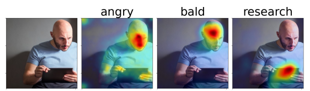

# What the DAAM: Interpreting Stable Diffusion Using Cross Attention

[](https://huggingface.co/spaces/tetrisd/Diffusion-Attentive-Attribution-Maps) [](https://gist.githubusercontent.com/daemon/1d126b5d72eb40300af5cccb92a232c6/raw/cd276203a7109bd9512f14afc86eebe8f13049ce/daam-citation.bib) [](https://pypi.org/project/daam) 



I regularly update this codebase. Please submit an issue if you have any questions.

In [our paper](https://arxiv.org/abs/2210.04885), we propose diffusion attentive attribution maps (DAAM), a cross attention-based approach for interpreting Stable Diffusion.
Check out our demo: https://huggingface.co/spaces/tetrisd/Diffusion-Attentive-Attribution-Maps.
Our [documentation](https://castorini.github.io/daam/) is hosted by GitHub pages.

## Using DAAM

First, install [PyTorch](https://pytorch.org) for your platform.
Then, install DAAM with `pip install daam`. If you want an editable version, then do `git clone https://github.com/castorini/daam && pip install -e daam`.

Using DAAM is easy.
You'll first need to login using `huggingface-cli login` to get many stable diffusion models.
Next, use DAAM as follows:

```python
from daam import trace, set_seed, plot_overlay_heat_map, expand_image
from diffusers import StableDiffusionPipeline
from matplotlib import pyplot as plt
import torch


model_id = 'CompVis/stable-diffusion-v1-4'
device = 'cuda'

pipe = StableDiffusionPipeline.from_pretrained(model_id, use_auth_token=True)
pipe = pipe.to(device)

prompt = 'A dog runs across the field'
gen = set_seed(0)

with torch.cuda.amp.autocast(dtype=torch.float16), torch.no_grad():
    with trace(pipe) as tc:
        out = pipe(prompt, num_inference_steps=30, generator=gen)
        heat_map = tc.compute_global_heat_map(prompt)
        heat_map = expand_image(heat_map.compute_word_heat_map('dog'))
        plot_overlay_heat_map(out.images[0], heat_map)
        plt.show()
```

We'll continue adding docs.
In the meantime, check out the `GenerationExperiment`, `HeatMap`, and `DiffusionHeatMapHooker` classes, as well as the `daam/run/*.py` example scripts.

## Running the Demo

To run the demo locally, execute this in an environment with PyTorch:
```bash
git clone https://github.com/castorini/daam && cd daam
cd space
pip install -r requirements.txt
huggingface-cli login  # Create an account and generate a token on huggingface.co
python app.py
```

Then, open http://127.0.0.1:8080 in your web browser.

Our datasets are here: https://git.uwaterloo.ca/r33tang/daam-data

## Citation
```
@article{tang2022daam,
  title={What the {DAAM}: Interpreting Stable Diffusion Using Cross Attention},
  author={Tang, Raphael and Pandey, Akshat and Jiang, Zhiying and Yang, Gefei and Kumar, Karun and Lin, Jimmy and Ture, Ferhan},
  journal={arXiv:2210.04885},
  year={2022}
}
```
