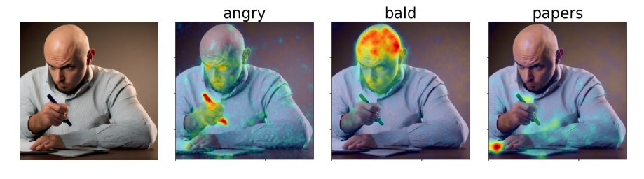

# What the DAAM: Interpreting Stable Diffusion Using Cross Attention

[](https://huggingface.co/spaces/tetrisd/Diffusion-Attentive-Attribution-Maps) [](https://gist.githubusercontent.com/daemon/1d126b5d72eb40300af5cccb92a232c6/raw/cd276203a7109bd9512f14afc86eebe8f13049ce/daam-citation.bib) [](https://pypi.org/project/daam) [](https://pepy.tech/project/daam)



### Updated to support Stable Diffusion V2!

I regularly update this codebase. Please submit an issue if you have any questions.

In [our paper](https://arxiv.org/abs/2210.04885), we propose diffusion attentive attribution maps (DAAM), a cross attention-based approach for interpreting Stable Diffusion.
Check out our demo: https://huggingface.co/spaces/tetrisd/Diffusion-Attentive-Attribution-Maps.
Our [documentation](https://castorini.github.io/daam/) is hosted by GitHub pages.
See [1littlecoder's video](https://www.youtube.com/watch?v=J2WtkA1Xfew) for a code demonstration and Colab notebook of DAAM.

## Using DAAM as a CLI Utility

DAAM comes with a simple generation script for people who want to quickly try it out.
First, install [PyTorch](https://pytorch.org) for your platform.
Then, install DAAM with `pip install daam`.
Next, login using `huggingface-cli login` to get many stable diffusion models -- you'll need to get a token at [HuggingFace.co](https://huggingface.co/).
Now, try running
```bash
$ mkdir -p daam-test && cd daam-test
$ daam "A dog running across the field."
$ ls
a.heat_map.png    field.heat_map.png    generation.pt   output.png  seed.txt
dog.heat_map.png  running.heat_map.png  prompt.txt
```
Your current working directory will now contain the generated image as `output.png` and a DAAM map for every word, as well as some auxiliary data.
You can see more options for `daam` by running `daam -h`.

## Using DAAM as a Library

First, install [PyTorch <= 1.13.0](https://pytorch.org) for your platform.
Then, install DAAM with `pip install daam`. If you want an editable version, then do `git clone https://github.com/castorini/daam && pip install -e daam`.

Using DAAM as a library is easy.
You'll first need to login using `huggingface-cli login` to get many stable diffusion models.
Next, import and call DAAM as follows:

```python
from daam import trace, set_seed
from diffusers import StableDiffusionPipeline
from matplotlib import pyplot as plt
import torch


model_id = 'stabilityai/stable-diffusion-2-base'
device = 'cuda'

pipe = StableDiffusionPipeline.from_pretrained(model_id, use_auth_token=True)
pipe = pipe.to(device)

prompt = 'A dog runs across the field'
gen = set_seed(0)  # for reproducibility

with torch.cuda.amp.autocast(dtype=torch.float16), torch.no_grad():
    with trace(pipe) as tc:
        out = pipe(prompt, num_inference_steps=30, generator=gen)
        heat_map = tc.compute_global_heat_map()
        heat_map = heat_map.compute_word_heat_map('dog')
        heat_map.plot_overlay(out.images[0])
        plt.show()
```

You can also serialize and deserialize the DAAM maps pretty easily:

```python
from daam import GenerationExperiment, trace

with trace(pipe) as tc:
    pipe('A dog and a cat')
    exp = tc.to_experiment('experiment-dir')
    exp.save()  # experiment-dir now contains all the data and heat maps

exp = GenerationExperiment.load('experiment-dir')  # load the experiment
```

We'll continue adding docs.
In the meantime, check out the `GenerationExperiment`, `GlobalHeatMap`, and `DiffusionHeatMapHooker` classes, as well as the `daam/run/*.py` example scripts.
Our datasets are here: https://git.uwaterloo.ca/r33tang/daam-data

## Citation
```
@article{tang2022daam,
  title={What the {DAAM}: Interpreting Stable Diffusion Using Cross Attention},
  author={Tang, Raphael and Pandey, Akshat and Jiang, Zhiying and Yang, Gefei and Kumar, Karun and Lin, Jimmy and Ture, Ferhan},
  journal={arXiv:2210.04885},
  year={2022}
}
```
